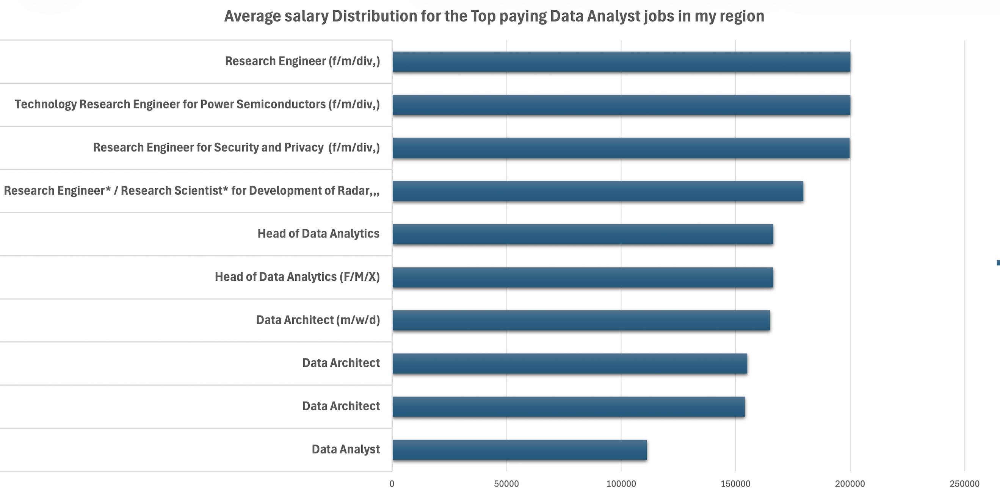
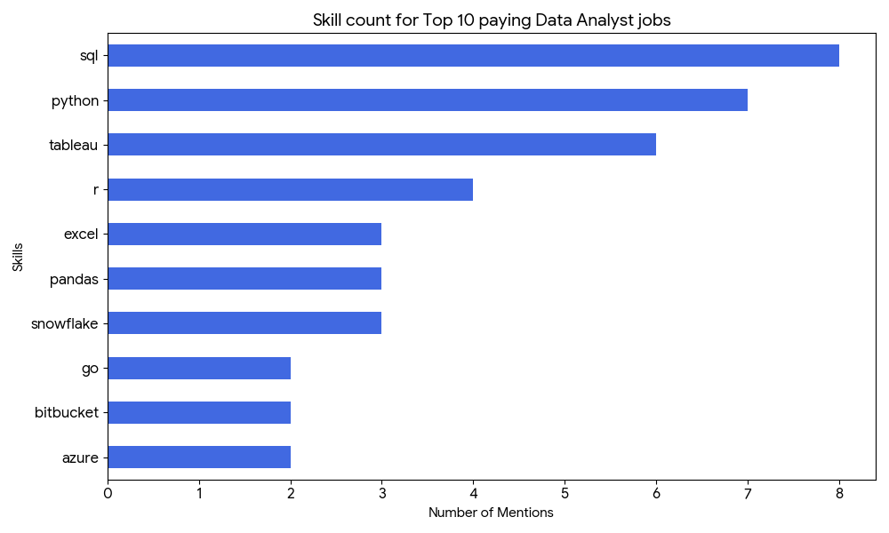

# Introduction.

I am a beginner in Data Analytics, and this project is part of my learning journey in my free time.
In this project, I explore the data job market with a focus on Data Analyst roles to better understand:
💰 top-paying jobs, 🔥 in-demand skills, and 📈 where high demand meets high salary in data analytics.
🔍 SQL queries? Check them out here: [project_sql folder](/project_sql/) folder.

# Backgroung
This project was created to help better understand the data analyst job market and to guide my learning path as a beginner.

The dataset comes from [Luke Barousse SQL Course](https://www.lukebarousse.com/sql)
 and includes information about job titles, salaries, locations, and required skills.

The questions I wanted to answer with SQL were:

1. What are the top-paying data analyst jobs?

2. What skills are required for these top-paying jobs?

3. What skills are most in demand for data analysts?

4. Which skills are linked to higher salaries?

5. What are the most optimal skills to learn as a beginner?

# Tools I used
For this project, I used the following tools while learning and practicing:

- SQL: to query and analyze the data.

- PostgreSQL: as the database system for job posting data.

- Visual Studio Code: to write and run SQL queries.

- Git & GitHub: to track my progress and share this project.

# The Analysis
Each query focuses on a specific question about the data analyst job market. This helped me understand how to turn questions into SQL queries and meaningful results.

### 1. Top Paying Data Analyst Jobs

To identify the highest-paying roles, I filtered data analyst positions by average yearly salary and location, focusing on my region (Hungary and Germany). This helped me understand what salary levels are possible in nearby job markets and which companies offer the best opportunities.

```sql
SELECT
    job_id,
    job_title,
    job_location,
    job_schedule_type,
    job_posted_date::DATE,
    salary_year_avg,
    company_dim.name AS company_name
FROM
    job_postings_fact
LEFT JOIN company_dim ON job_postings_fact.company_id = company_dim.company_id
WHERE
    job_title_short = 'Data Analyst' AND
    (job_location LIKE '%Hungary%' OR job_location LIKE '%Germany') AND
    salary_year_avg IS NOT NULL
ORDER BY salary_year_avg DESC
LIMIT 10;
```
Here's the breakdown of the top data analyst jobs in 2023:
- **Highest Salaries**: Research Engineer roles at Bosch reach around $200,000/year, showing strong pay for specialized technical roles.

- **Senior Roles Pay More**: Head of Data Analytics and Data Architect positions offer $154K–$166K, highlighting the value of experience and leadership.

- **Data Analyst Role**: A standard Data Analyst position (Prezi, Budapest) appears at $111K, showing the starting point for high-paying opportunities.

- **Location Matters**: Top-paying jobs cluster in major German cities and Budapest, indicating hubs for analytics careers.

*Bar graph visualizing the salary for the top 10 salaries for data analysts; The chart was generated using an Excel Pivot Table based on the analyzed dataset*

### 2. Skills for Top Paying Jobs
To identify what skills are required for the highest-paying Data Analyst roles, I joined the job postings with the skills data.
I focused only on remote jobs because they represent a larger sample size and provide more reliable insights into global market demand.
```sql
WITH top_paying_jobs AS (
    SELECT
        job_id,
        job_title,
        salary_year_avg,
        company_dim.name AS company_name
    FROM
        job_postings_fact
    LEFT JOIN company_dim ON job_postings_fact.company_id = company_dim.company_id
    WHERE
        job_title_short = 'Data Analyst' AND
        job_location = 'Anywhere' AND
        salary_year_avg IS NOT NULL
    ORDER BY salary_year_avg DESC
    LIMIT 10
)
SELECT 
    top_paying_jobs.*,
    skills
FROM top_paying_jobs
INNER JOIN skills_job_dim ON top_paying_jobs.job_id = skills_job_dim.job_id
INNER JOIN skills_dim ON skills_job_dim.skill_id = skills_dim.skill_id
ORDER BY
    salary_year_avg DESC
```
Here's the breakdown of the most demanded skills for data analysts, based on job postings:
  - **SQL** is   with a bold count of 8.
  - **Python** follows closely with a bold count of 7.
  - **Tableau** is also highly sought after, with a bold count of 6.
  Other skills like R, Snowflake, Pandas, and Excel show varying degrees of demand.

*Bar graph visualizing the count of skills for the top 10 paying jobs for data analysts; Google Gemini generated this graph from my SQL query results*

### 3. In-Demand Skills for Data Analysts
This query identifies the most requested skills in job postings.
```sql
SELECT 
    skills.skills,
    COUNT (skill_to_job.*) AS demand_count
FROM
    skills_job_dim AS skill_to_job
INNER JOIN job_postings_fact AS job_postings ON skill_to_job.job_id = job_postings.job_id
INNER JOIN skills_dim AS skills ON skill_to_job.skill_id = skills.skill_id
WHERE
    job_postings.job_title_short = 'Data Analyst' 
GROUP BY
    skills.skills
ORDER BY
    demand_count DESC
LIMIT 5;
```
Here’s a brief breakdown of the most in-demand skills for Data Analysts based on job postings:

**SQL** and **Excel** dominate the demand, with 92,628 and 67,031 postings, confirming they are the core foundational skills for Data Analysts.

**Python**, **Tableau**, and **Power BI** follow as key advanced skills, showing strong demand for programming and data visualization expertise in the job market.

| skills   |   demand_count|
|----------|---------------|
| sql      |   92628       |
| excel    |   67031       |
| python   |   57326       |
| tableau. |   46554       |
| power bi |   39468       |

----------------------------
*Table of the demand for the top 5 skills in data analyst job postings*

### 4. Skills Based on Salary
This analysis looks at which skills are associated with higher average salaries.
```sql
SELECT 
    skills.skills,
    ROUND (AVG(job_postings.salary_year_avg), 0) AS skill_avg_salary
FROM
    skills_job_dim AS skill_to_job
INNER JOIN job_postings_fact AS job_postings ON skill_to_job.job_id = job_postings.job_id
INNER JOIN skills_dim AS skills ON skill_to_job.skill_id = skills.skill_id
WHERE
    job_postings.job_title_short = 'Data Analyst'
    AND salary_year_avg IS NOT NULL
    AND job_postings.job_work_from_home = TRUE
GROUP BY
    skills.skills
ORDER BY
    skill_avg_salary DESC
LIMIT 30;
```
Here's a breakdown of the results for top paying skills for Data Analysts:

- **Big Data & AI Powerhouses**: The biggest paychecks come from handling massive datasets and AI. Mastering PySpark ($208k) or DataRobot ($155k) proves you can manage complex information and build predictive models.

- **Software & Teamwork Tools**: Companies pay extra for analysts who work like developers. Using tools like Bitbucket ($189k) and GitLab ($154k) shows you can organize code and collaborate efficiently within a professional tech team.

- **Core Python & Cloud Skills**: Standard tools like Pandas ($151k) and cloud platforms like Databricks ($141k) remain high-paying essentials. These skills allow you to clean data and run analyses in modern, cloud-based environments.

| Skills        | Average Salary ($) |
|---------------|--------------------|
| pyspark       |            208,172 |
| bitbucket     |            189,155 |
| watson        |            160,515 |
| couchbase     |            160,515 |
| datarobot     |            155,486 |
| gitlab        |            154,500 |
| swift         |            153,750 |
| jupyter       |            152,777 |
| pandas        |            151,821 |
| golang        |            145,000 |

--------------------------------------
*Table of the average salary for the top 10 paying skills for data analysts*

### 5. Most Optimal Skills to Learn
This step combines demand and salary to find skills that are both useful and well-paid.
```sql
SELECT 
    skills_dim.skill_id,
    skills_dim.skills,
    COUNT(skills_job_dim.job_id) AS demand_count,
    ROUND(AVG(job_postings_fact.salary_year_avg),0) AS avg_salary
FROM
    job_postings_fact
INNER JOIN skills_job_dim ON job_postings_fact.job_id = skills_job_dim.job_id
INNER JOIN skills_dim ON skills_job_dim.skill_id = skills_dim.skill_id
WHERE
    job_postings_fact.job_title_short = 'Data Analyst'
    AND job_postings_fact.salary_year_avg IS NOT NULL
    AND job_work_from_home = TRUE
GROUP BY
    skills_dim.skill_id
HAVING
    COUNT(skills_job_dim.job_id) > 10
ORDER BY
    avg_salary DESC,
    demand_count DESC;
```
Here's a breakdown of the most optimal skills for Data Analysts:

- Cloud tools such as Snowflake, Azure, AWS, and BigQuery appear frequently with strong salaries.

- Programming languages like Python and R remain essential and widely demanded.

- Visualization tools like Tableau and Looker show how important data storytelling is in analytics.

| Skill ID | Skills     | Demand Count | Average Salary ($) |
|----------|------------|--------------|-------------------:|
| 8        | go         | 27           |            115,320 |
| 234      | confluence | 11           |            114,210 |
| 97       | hadoop     | 22           |            113,193 |
| 80       | snowflake  | 37           |            112,948 |
| 74       | azure      | 34           |            111,225 |
| 77       | bigquery   | 13           |            109,654 |
| 76       | aws        | 32           |            108,317 |
| 4        | java       | 17           |            106,906 |
| 194      | ssis       | 12           |            106,683 |
| 233      | jira       | 20           |            104,918 |

*Table of the most optimal skills for data analyst sorted by salary*

# What I learned

Through this project, I improved my SQL skills and learned how to analyze real job market data:

- Writing more advanced SQL queries using JOIN and WITH clauses.

- Using GROUP BY with functions like COUNT() and AVG().

- Turning business questions into structured SQL queries.

Understanding how skills and salaries relate in the job market.
# Conclusion

### Insights

1. Top-paying data analyst jobs offer very high salary potential, especially for remote roles.

2. SQL is both the most demanded skill and one of the most important for high-paying jobs.

3. Specialized and cloud-related skills can significantly increase salary opportunities.

4. Learning a mix of SQL, Python, and visualization tools provides strong market value.

5. Focusing on high-demand and high-salary skills is a smart strategy for beginners.

### Closing Thoughts

This project represents my learning journey as a beginner in Data Analytics.
It helped me practice SQL, understand the job market, and identify which skills I should focus on next.

By working on real data and asking practical questions, I am slowly building my knowledge and confidence in data analytics while studying in my free time.
